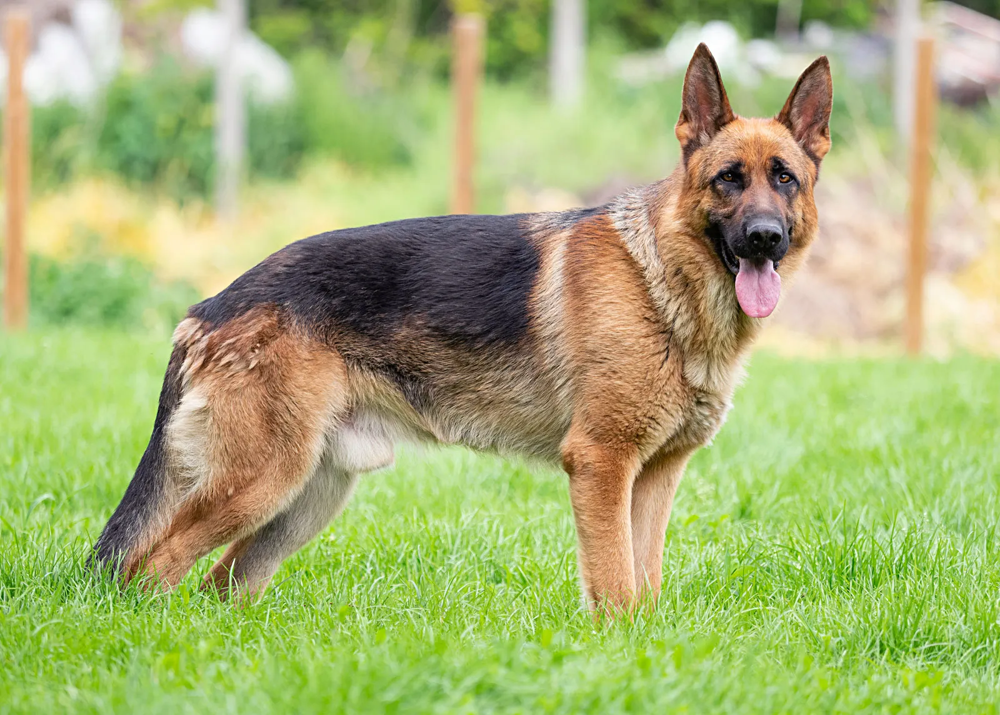

<!DOCTYPE html>

<html lang="en">
<head>
    <meta charset="UTF-8">
    <meta name="viewport" content="width=device-width, initial-scale=1.0">
    <title>My Favorite Dogs</title>
</head>
<body>

```
<header>
    <h1>My Favorite Dogs</h1>
    <p>A simple website about some amazing dog breeds.</p>
</header>

<main>

    <section>
        <h2>Why I Like Dogs</h2>
        <p>
            Dogs are loyal, friendly, and intelligent animals.
            They make great companions and are loved by millions of people around the world.
        </p>
    </section>

    <section>
        <h2>Popular Dog Breeds</h2>
        <ul>
            <li>Golden Retriever</li>
            <li>German Shepherd</li>
            <li>Labrador Retriever</li>
        </ul>
    </section>

    <section>
        <h2>Dog Gallery</h2>

        <figure>
            
            <figcaption>Golden Retriever</figcaption>
        </figure>

        <figure>
            
            <figcaption>German Shepherd</figcaption>
        </figure>

        <figure>
            
            <figcaption>Labrador Retriever</figcaption>
        </figure>

    </section>

    <section>
        <h2>Learn More</h2>
        <p>
            Visit
            <a href="https://en.wikipedia.org/wiki/Dog">
                Wikipedia's Dog Article
            </a>
            to learn more about dogs.
        </p>
    </section>

</main>

<footer>
    <p>&copy; 2026 My Favorite Dogs</p>
</footer>
```

</body>
</html>
